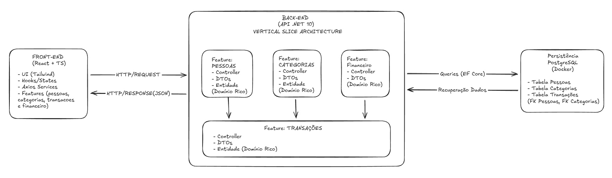
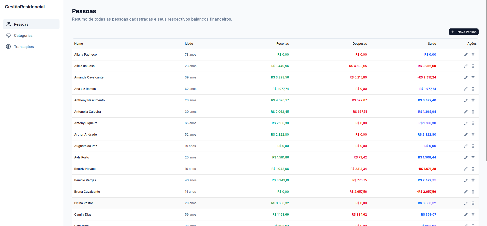
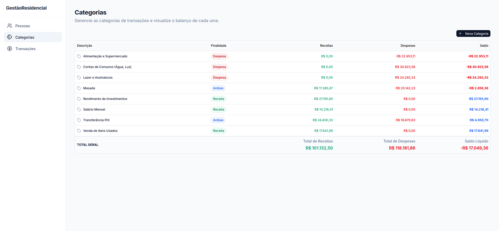
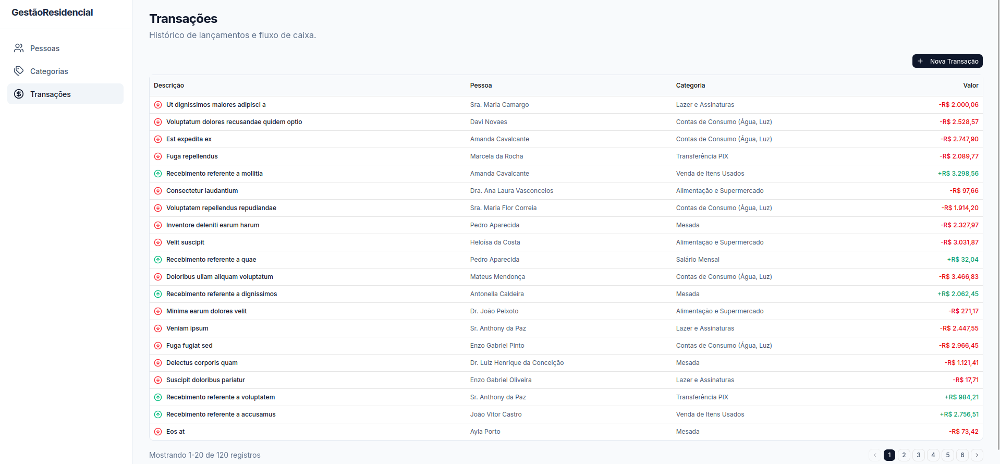

# Sistema de Gestão Residencial


Uma aplicação Full-Stack desenvolvida para o controle e gestão de gastos residenciais. O sistema permite o gerenciamento completo de Pessoas, Categorias e Transações financeiras, aplicando regras de negócio rigorosas e gerando relatórios consolidados de fluxo de caixa.

Este projeto foi construído com foco em Clean Code, Domínio Rico (DDD) e Vertical Slice Architecture, garantindo que a aplicação seja fácil de manter, testar e evoluir.

## Telas da Aplicação
Visão geral da interface do sistema:






---

## Índice

* [Trade-offs](#trade-offs)
* [Tecnologias Utilizadas](#tecnologias-utilizadas)
* [Como Executar o Projeto](#como-executar-o-projeto)
* [Como Executar os Testes](#como-executar-os-testes)

---

## Trade-offs

Para garantir um código de fácil manutenção e escalável, tomei as seguintes decisões técnicas:

### Back-end (.NET 10)
* **Vertical Slice Architecture (Organização por Features):** O projeto foi estruturado em fatias verticais. Tudo o que pertence a um domínio de negócio (ex: `Transacoes`) vive na mesma pasta (Controller, Entidade, DTOs e Enums). Isso garante altíssima coesão, baixo acoplamento e torna a navegação no código muito mais intuitiva e fácil.
* **Domínio Rico (Rich Domain):** Validações de negócio, como impedir que menores de idade registrem receitas ou atrelar transações a categorias com finalidades incompatíveis, estão encapsuladas nos construtores das entidades.
* **Fail-Fast Validations:** Utilização de Data Annotations nos DTOs para barrar requisições malformadas antes de chegarem aos Controllers.
* **Global Exception Handler:** Tratamento de erros global que captura exceções de domínio (`ArgumentException`, `ArgumentOutOfRangeException`) e as converte para o padrão HTTP 400 (RFC 7807 - Problem Details), evitando vazamento de stack trace e fornecendo mensagens claras ao Front-end.
* **Auto-Migrations:** Configuração do Entity Framework Core para aplicar as migrações automaticamente na execução da API. O banco é criado e estruturado sem necessidade de comandos CLI manuais.
* **Deleção em Cascata:** Relacionamentos mapeados via EF Core (`OnDelete(DeleteBehavior.Cascade)`) garantindo que a exclusão de uma pessoa remova todas as suas transações automaticamente, mantendo a integridade referencial.

### Front-end (React + TypeScript)
* **Ecossistema Moderno:** Setup utilizando Vite.
* **Feature-Based Structure:** Espelhando a arquitetura do back-end, cada domínio tem sua pasta (`features/pessoas`, `features/categorias`), contendo seus próprios componentes, tipos e chamadas de API (`pessoaService.ts`). Isso isola o escopo de cada funcionalidade e facilita a manutenção de cada funcionalidade.
* **UI/UX Limpa e Responsiva:** Componentização baseada em Tailwind CSS e Shadcn UI, entregando uma interface profissional e acessível.
* **Single Responsibility Principle (SRP):** Camada de integração com a API totalmente isolada via Axios (ex: `pessoaService.ts`, `transacaoService.ts`), separando a lógica de rede da lógica de apresentação.
* **Performance:** Paginação e totalização de relatórios processadas no servidor (Back-end) para evitar sobrecarga de memória no cliente. O **Requisito Opcional** de *Consulta de totais por categoria* foi implementado e entregue com sucesso.

### Testes Automatizados
* **Isolamento de Domínio (Back-end):** Testes de unidade focados exclusivamente no Domínio Rico (`Pessoa`, `Transacao`, `Categoria`), garantindo que as regras de negócio vitais funcionem sem o peso de infraestrutura.
* **Testes de Integração (Back-end):** Utilização do `WebApplicationFactory` com um banco de dados em memória (EF Core In-Memory) para testar os endpoints de ponta a ponta. Isso garante que a injeção de dependência, o roteamento e as validações HTTP (Problem Details) funcionem conforme o esperado.
* **Testes de Componentes (Front-end):** Configuração do Vitest junto com o React Testing Library. O foco foi validar o comportamento da interface (abertura de modais, renderização condicional de listas e exibição de totais), utilizando *mocks* nos serviços de API (`vi.mock`) para garantir testes rápidos e previsíveis.

## Tecnologias Utilizadas

**Back-end**
* C# e .NET 10 (Web API)
* Entity Framework Core (ORM)
* PostgreSQL (Banco de dados relacional)
* Scalar (Documentação interativa da API)

**Front-end**
* React 19 com TypeScript
* Vite (Build tool)
* Tailwind CSS + Shadcn UI (Estilização e Componentes)
* Axios (HTTP Client)
* React Router DOM (Navegação)

**Testes**
* xUnit
* FluentAssertions
* EF Core In-Memory Database (Testes de Integração)

**Infraestrutura e Automação**
* Docker & Docker Compose
* Python + Faker (Mock Data Generator)
* Bash Scripts (Orquestração de ambiente)

## Como Executar o Projeto

Preparei um ambiente automatizado para facilitar a execução do projeto.

### Pré-requisitos
* Docker
* .NET 10 SDK
* Node.js
* Python 3 (para script)

### Variáveis de Ambiente
Na raiz do repositório, crie o arquivo .env e adicione suas informações do banco de dados.
```text
DB_USER=postgres
DB_PASSWORD=password
DB_NAME=db_name
```

### Passo 1: Infraestrutura (Banco de Dados)
Na raiz do repositório, execute o script de automação para subir o PostgreSQL via Docker e preparar o ambiente virtual Python. Vale ressaltar que existem dois script, um para Windows e outro para Linux/Mac, use o correspondente ao seu sistema e certifique-se que o **Docker** esteja ligado.
```bash
# Linux/Mac
bash ./setup.sh 

# Windows
.\setup.ps1
```

### Passo 2: Iniciar a API (Back-end)
O banco de dados será criado e as migrações aplicadas automaticamente ao rodar a API. E também, não esqueça de adicionar o user-secrets.
```bash
cd backend/src/GestaoResidencial.Api

# Substitua pelos valores que você definiu no seu .env
dotnet user-secrets set "ConnectionStrings:DefaultConnection" "Host=localhost;Port=5432;Database=db_name;Username=postgres;Password=SENHA"

dotnet run
```
A API estará disponível em: https://localhost:7278/scalar/v1

### Passo 3: Popular o Banco de Dados (Seed Automático)
Para não ter que cadastrar tudo manualmente, criei um script que gera uma dados falsos, respeitando todas as regras de negócio do projeto. Rode os comandos correspondentes ao seu sistema (Linux/Mac ou Windows).

Abra outro terminal na raiz do projeto e execute:
```bash
# Ative o ambiente virtual e rode o script (Linux/Mac)
source scripts/.venv/bin/activate
python scripts/seed_api.py

# Se estiver no Windows (PowerShell):
.\scripts\.venv\Scripts\Activate.ps1
python scripts\seed_api.py
```
O script criará dezenas de pessoas, categorias e transações automáticas via API.

### Passo 4: Iniciar o Front-end
Abra um novo terminal, instale as dependências e rode o client web:

```bash
cd frontend
npm install
npm run dev
```
O sistema estará disponível em: http://localhost:5173

## Como Executar os Testes

O projeto conta com uma suíte abrangente para garantir a qualidade do código em ambas as pontas. 

**Back-end:**
Os testes cobrem as regras de negócio do Domínio Rico (Unidade) e o comportamento real dos endpoints da API (Integração).
- Na raiz da pasta `backend/`, execute:
`dotnet test`

**Front-end:**
Testes focados na interação do usuário com os componentes da interface, garantindo que fluxos como abertura de modais e listagens funcionem corretamente.
- Na raiz da pasta `frontend/`, execute:
`npm run test`

## License

Distribuído sob a licença MIT. Consulte o arquivo [LICENSE](./LICENSE) para obter mais informações.